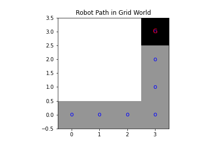
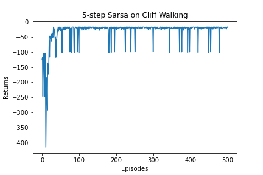
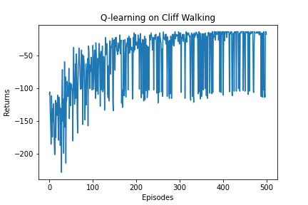

**Temporal difference** is a method used to estimate the value function of a strategy.

It combines the ideas of Monte Carlo and dynamic programming algorithms:

* Similarities between Temporal difference method and **Monte Carlo**: Can learn from sample data without prior knowledge of the environment.
* Similarities between Temporal difference method and **Dynamic programming**: According to the idea of Bellman equation, the value estimate of the <u>current state</u> is updated by the value estimate of the <u>subsequent state</u>.

**Monte Carlo method**: Using <u>probability and statistical methods</u> to induce numerical estimates of the target we want from the sampling results.

State-value function based on strategy π in MDP :
【The value of <u>a single state</u> is its expected return】
$$V^\pi (s) = E_\pi [G_t | S_t = s]$$

However, MDP will have many state directions, so sampling on the MDP chain with a policy will have many sequences, which can be set to N sequences.
$$V^\pi (s) \times N = E_\pi [G_t | S_t = s] \times N$$
$$E_\pi [G_t | S_t = s] \times N \gets G_1 + G_2 + G_3 + ... + G_{t-1} + G_t$$
$$V^\pi (s) = E_\pi [G_t | S_t = s] \approx \frac{1}{N} \sum_{N}^{i = 1} G_{t}^{(i)}$$

Monte Carlo method for the <u>incremental update</u> of the value function:
$$
V(s_t) \gets V(s_{t-1}) + \alpha [G_{t-1} - V(s_{t-1})]
$$

1/N(s) is replaced by a, indicating the step size of the update of the value estimate. At this point, the update method is no longer as strict as the Monte Carlo method of expectation. $\alpha$ can be set as a constant or as an intelligent function f(x).

The Monte Carlo method requires <u>waiting until the entire sequence sampling is completed</u> to calculate the return  G for that episode, whereas the Temporal Difference (TD) algorithm can perform the calculation at <u>the end of the current step</u>.

The TD algorithm uses the reward obtained at <u>the current step</u> $V(s_t) = V(s_{t-1}) + r_t$ plus the estimated value of the next state as the return for the current state：
$$
V(s_t) \gets V(s_{t}) + \alpha [r_t + \gamma V(s_{t+1} - V(s_t)) ]
$$
where, $r_t + \gamma V(s_{t+1} - V(s_t)$ is TD, and the reason we use it instead of G is:

$$\because G_t = \sum_{k = 0}^{\infty} \gamma^{k} R_{t+k} $$
$$V^\pi (s) = E_\pi [G_t | S_t = s]$$
$$E_\pi [R_t + \gamma \sum_{k = 0}^{\infty} \gamma^{k} R_{t+k+1} | S_t = s]$$
$$E_\pi [R_t + \gamma V^\pi(S_{t+1}) | S_t = s]$$

The estimate of $V^\pi(S_{t+1})$ eventually converges to the value function of the policy π.
## Q_learning robot grib

## sarsa raward 

## n步Sarsa算法

## Q_learning
