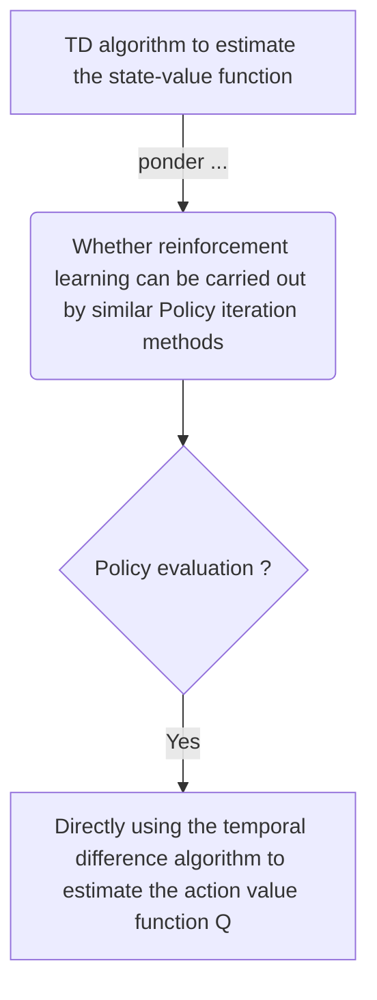
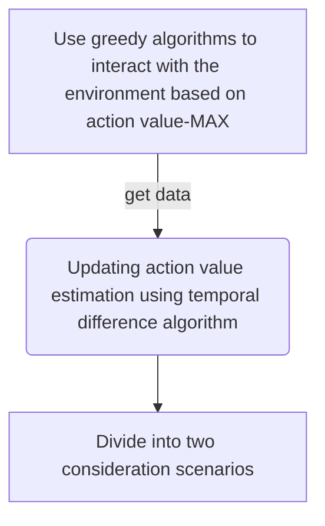
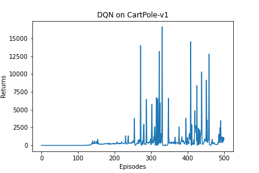
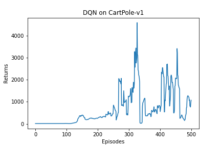

**Temporal difference** is a method used to estimate the value function of a strategy.

It combines the ideas of Monte Carlo and dynamic programming algorithms:

* Similarities between Temporal difference method and **Monte Carlo**: Can learn from sample data without prior knowledge of the environment.
* Similarities between Temporal difference method and **Dynamic programming**: According to the idea of Bellman equation, the value estimate of the <u>current state</u> is updated by the value estimate of the <u>subsequent state</u>.

**Monte Carlo method**: Using <u>probability and statistical methods</u> to induce numerical estimates of the target we want from the sampling results.

State-value function based on strategy π in MDP :
【The value of <u>a single state</u> is its expected return】
$$V^\pi (s) = E_\pi [G_t | S_t = s]$$

However, MDP will have many state directions, so sampling on the MDP chain with a policy will have many sequences, which can be set to N sequences.
$$V^\pi (s) \times N = E_\pi [G_t | S_t = s] \times N$$
$$E_\pi [G_t | S_t = s] \times N \gets G_1 + G_2 + G_3 + ... + G_{t-1} + G_t$$
$$V^\pi (s) = E_\pi [G_t | S_t = s] \approx \frac{1}{N} \sum_{N}^{i = 1} G_{t}^{(i)}$$

Monte Carlo method for the <u>incremental update</u> of the value function:
$$V(s_t) \gets V(s_{t-1}) + \alpha [G_{t-1} - V(s_{t-1})]$$

1/N(s) is replaced by a, indicating the step size of the update of the value estimate. At this point, the update method is no longer as strict as the Monte Carlo method of expectation. $\alpha$ can be set as a constant or as an intelligent function f(x).

The Monte Carlo method requires <u>waiting until the entire sequence sampling is completed</u> to calculate the return  G for that episode, whereas the Temporal Difference (TD) algorithm can perform the calculation at <u>the end of the current step</u>.

The TD algorithm uses the reward obtained at <u>the current step</u> $V(s_t) = V(s_{t-1}) + r_t$ plus the estimated value of the next state as the return for the current state：
$$V(s_t) \gets V(s_{t}) + \alpha [r_t + \gamma V(s_{t+1} - V(s_t)) ]$$
where, $r_t + \gamma V(s_{t+1} - V(s_t)$ is TD, and the reason we use it instead of G is:

$$\because G_t = \sum_{k = 0}^{\infty} \gamma^{k} R_{t+k}$$

$$V^\pi (s) = E_\pi [G_t | S_t = s]$$

$$= E_\pi [R_t + \gamma \sum_{k = 0}^{\infty} \gamma^{k} R_{t+k+1} | S_t = s]$$

$$= E_\pi [R_t + \gamma V^\pi(S_{t+1}) | S_t = s]$$

The estimate of $V^\pi(S_{t+1})$ eventually converges to the value function of the policy π.
## Q_learning robot grib

https://kroki.io/

$$arg max_a Q(s_t, a_t) \gets Q(s_t, a_t) + \alpha [r_t + \gamma Q(s_{t+1}, a_{t+1}) - Q(s_t, a_t] $$

Policy promotion without knowing the reward function and state transition function:
1. Policy promotion can be carried out when the policy evaluation is not fully carried out --- **generalized policy iteration**.
2. There is a $1 - \epsilon$ probability of using the action with the highest value, and another probability of $\epsilon$ randomly taking an action from the action space:

## sarsa raward 

## n步Sarsa算法

## Q_learning

## Deep Q_learning Network CartPole-v1 reward

## DQN CartPole-v1 reward with moving average

CNN for image recognition which can refer to https://arxiv.org/abs/1312.5602

## multi-agent reinforcement learning and paper
Refer to [Multi-Agent Transfer Learning via Temporal Contrastive Learning](https://www.ri.cmu.edu/publications/multi-agent-transfer-learning-via-temporal-contrastive-learning/), [[paper pdf]](https://www.ri.cmu.edu/app/uploads/2024/06/2024_ICRA_MAD_workshop.pdf)

### 

### centralized training with decentralized execution, CTDE (Advanced paradigm)
#### multi-agent DDPG (Based on Actor-Critic method)
All agents share a centralized Critic network，which is provide guidance to each agent's Actor network during the training process. When executed, the Actor network of each agent acts completely independently.

Application scenario of the CTDE algorithm:
* Modeled as a partially observable Markov game
S: State space (Global information)
$A_i$ : The action space of each agent i
$Q_i$ ：Observation space
$\pi_i$ : Each agent's policy
$Q_i \times A_i \to [0, 1]$ is a probability distribution, it is used to represent the probability that the agent will take each action under each observation.
$P: S \times A_1 \times A_2 \times ... \times A_N \to S$ , The state transition function of the environment.   
$r_i : S \times A_i \to R$, Reward function for each intelligent agent.
$o_i : S \to Q_i$, Partial observation information obtained by each intelligent agent from the global state.
$\rho : S \to [0, 1]$, Initial state distribution.
$R_i =  {\textstyle \sum_{t=0}^{T} \gamma ^t r^t_i}$, The goal of each agent is to maximize its desired cumulative reward.

Set policy parameters for each agent：$\theta = {\theta_1, ..., \theta_N}$
Note π = {π_1, ..., π_N} is the policy set of all agents.
The policy gradient of the expected return for each agent under stochastic strategy:
$$\bigtriangledown_{\theta_i} J(\theta_i) = E_{s\sim p^\mu , a \sim \pi_i}[log\pi_i(a_i | 0_i) Q^\pi_i(x, a_1, ..., a_N)]$$

among, $Q^\pi_i(x, a1, ..., a_N)]$ is a centralized action value function, its because generally speaking, x = (O,..., o_w) contains observations from all agents. $Q_i$ is also necessary to input the actions of all agents at the moment. 
Therefore, the premise of $Q_i$ operation is that all agents should give their own observations and corresponding actions at the same time.

For **deterministic strategies**, considering that there are now N continuous strategies $\mu_{\theta}$, the gradient formula for DDPG can be obtained:
$$\bigtriangledown_{\theta_i} J(\theta_i) = E_{x \sim D }[\bigtriangledown_{\theta_i} \mu_i(o_i) \bigtriangledown_{a_i} Q^\mu_i(x, a_1, ..., a_N)|_{a_i = \mu_i(o_i)}]$$

Where D is the experiential playback pool we use to store data, it stores each data as $(x, {x}', {x}'', ..., {x}^{(n)}, a_1, ..., a_N, r_1, ..., r_N )$.
In MADDPG, however, **the centralized action value function** can be updated with the following loss function:
$L(\omega_i) = E_{x, a, r, {x}'}[Q^\mu_i(x, a_1, ..., a_N) - y^2]$
$y = r_i + \gamma Q^\mu_i(x', a_1', ..., a_N')|a_j' = \mu_j'(o_j)$
where，$\mu = (\mu_{\theta_1}', ..., \mu_{\theta_N}')$ is a set of target policies used in the update value function with deferred update parameters.
